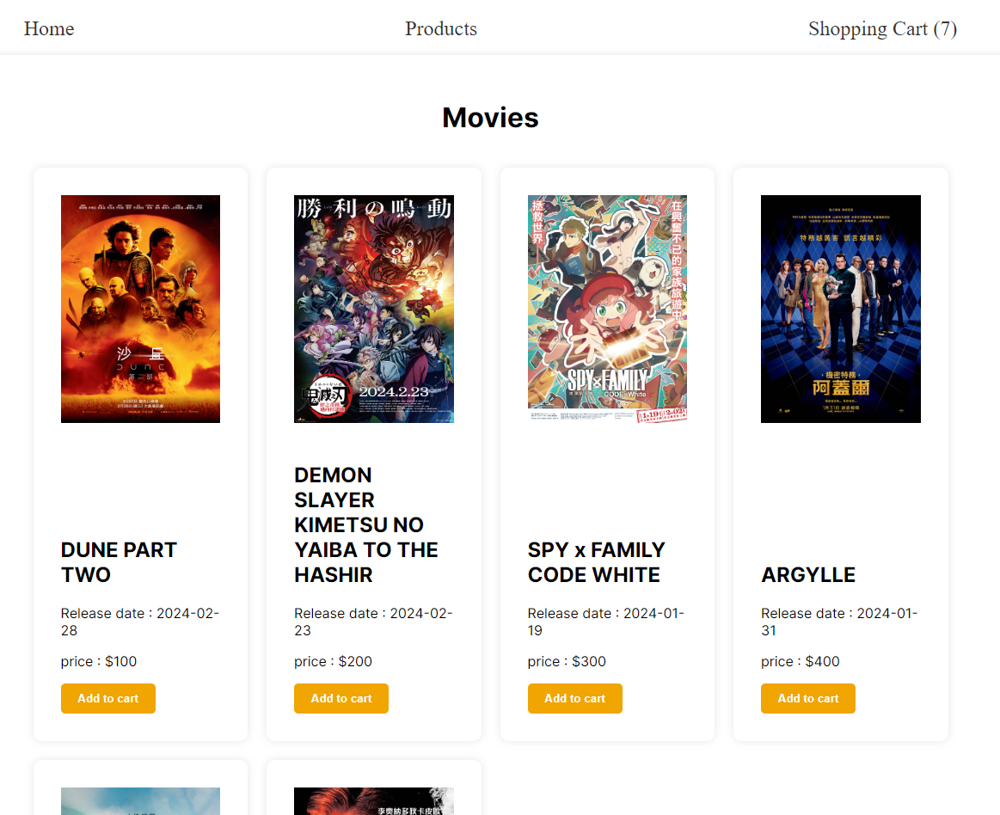
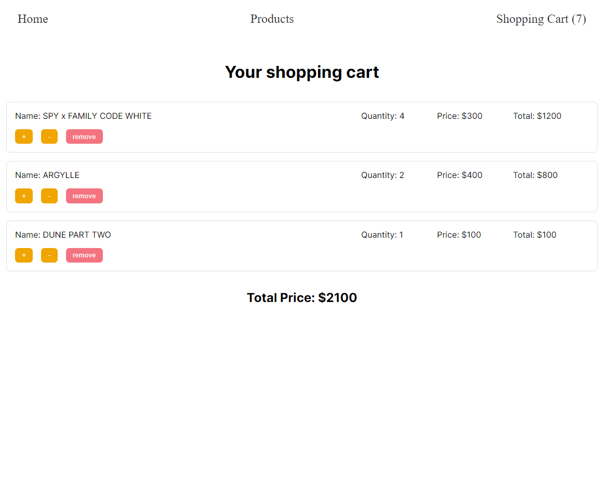

This project is under a training plan for being a web frontend engineer. \
Below are the key results: one homework and a presentation that comprises the concepts and usage of redux/redux toolkit.

### Homework 8 Shopping Cart

- Basic requirement: (w 2 pages)
  - /products: to browse products information (name / thumbnail / price / etc.), and a button to add products into shopping cart
  - /shopping-cart: list products which have been added into shopping cart
  - Note: store shopping cart products in redux states to achieve cross-page states sharing.
- Advanced:
  - decorates UI with Scss/Sass
- Implementation
  - deployment on Vercel

### Presentation

[Week4: Redux and Sass/SCSS](https://docs.google.com/presentation/d/1ItyGFcs_dAV6hNoFGIrGfQPLN-A9HcOaiJrw9LJEqNk/edit?usp=sharing), which includes:

#### Part 1: redux

- Why and What is redux
- When to adopt redux
- How to use redux
- Actions, reducers, store, async actions
- Redux toolkit
- How to use redux toolkit

#### Part 2: Sass, Scss

- Variables, nesting, mixins, functions
- Demo of hw7 and hw8
- Other concepts: context vs redux, etc.
